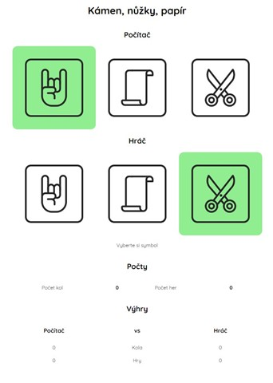

# Kámen, nůžky, papír

Pomocí knihovny React vytvořte následující aplikaci.

Toto zadání je jednoduchou verzí klasické hry Kámen, nůžky, papír. V každém kole si hráč volí jednu z herních figur, počítač volí svou generátorem náhodných čísel. Každá hra končí v okamžiku, kdy jedna strana dosáhne dvou vítězství. 
Aplikace eviduje počet odehraných kol v rámci hry, počet her, počet vítězných kol a her hráče a počítače.

## Zadání

* K dispozici máte základní vzhled aplikace v souboru App.js - tuto šablonu není nutné použít
* Aplikaci vhodně rozdělte na jednotlivé komponenty
* Vytvořte stav nebo stavy aplikace přes které budou napříč aplikací vyměňována data
* Vytvořte obslužný kód pro kliknutí na jednotlivé symboly
* Generujte tah počítače po tahu hráče - ideálně přes useEffect
* Evidujte a zobrazujte statistická data hry    
  * Počet kol v aktuální hře
  * Počet všech hraných her (na dvě vítězná kola)
  * * Počty her a kol vyhraných počítačem a hráčem